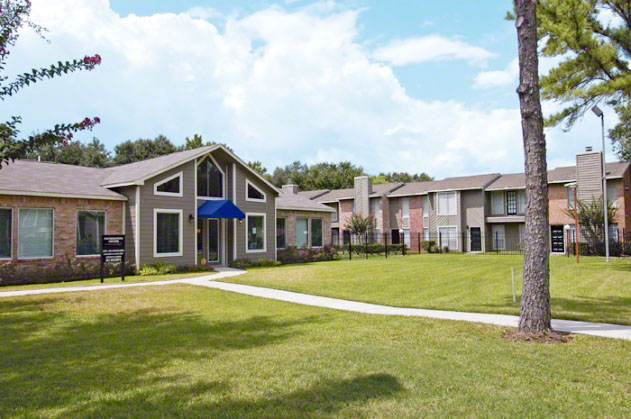
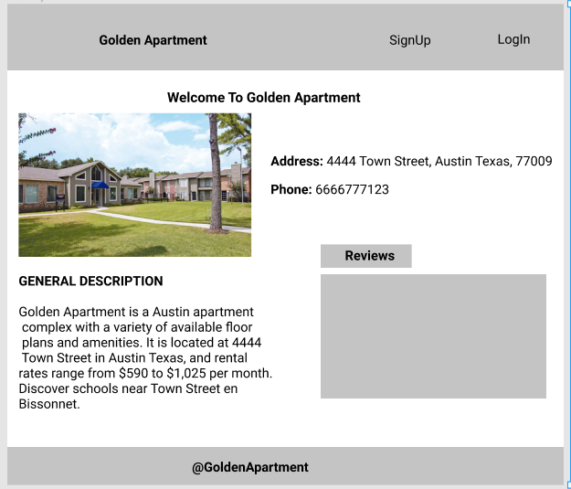
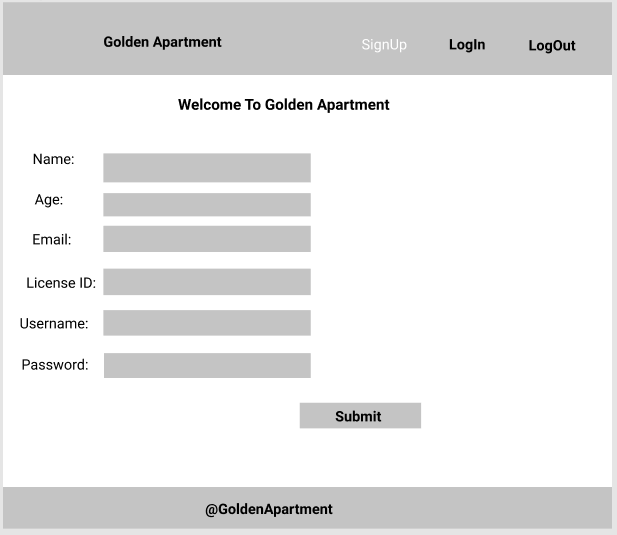
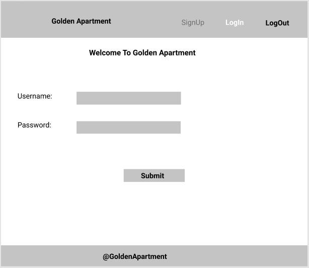
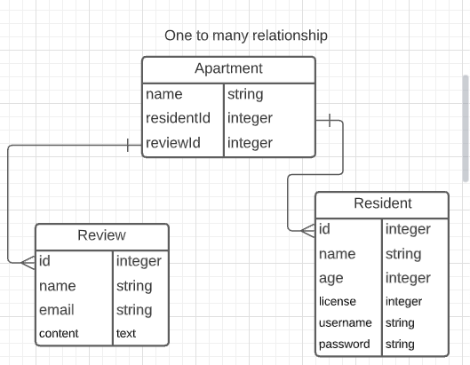

#  Application

## Golden Apartment App

* This application is for one apartment complex that consists of a lot of resident.

### Motivation

* I will like to put all what have learnt in to practice

---

## Screenshots of the apartment 

---
### User Stories
An application for an apartment complex.

* Future and current residents will be able to write reviews without signing-up or login.
* To lease an apartment, you will have to sign up.
* Current resident have to sign in to use the app, in other to  communicate directly to the apartment complex for day to day interaction.
---

### Wireframes

---
## Data Models 

#### TO CREATE MODEL:
* apartment
* resident
* review

 * sequelize model:create --name apartment --attributes name:string,bedrooms:integer,bathrooms:integer,residentId:integer

 * sequelize model:create --name user --attributes name:string,license:string,email:string,password:string

 * sequelize model:create --name review --attributes name:string,email:string,content:text,apartmentId:integer

## ERD - entity relationship diagram
* one to many relationship

---

## Technologies 
### Languages
* Node.js
* Html
* CSS
* Javascript
### Dependencies
* ejs
* express
* bcrypt
* connect-flash
* dotenv
* ejs
* express
* express-ejs-layouts
* express-session
* morgan
* passport
* passport-local
* pg
* sequelize
### Testing 
* chai
* mocha
### Version control
* git
* github
### Database
* postgres